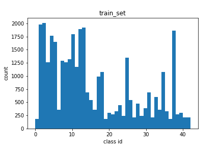
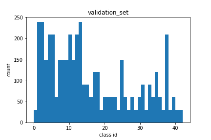
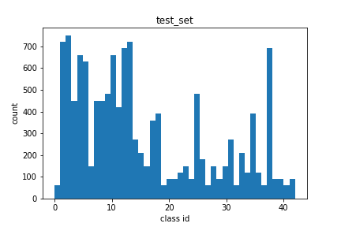
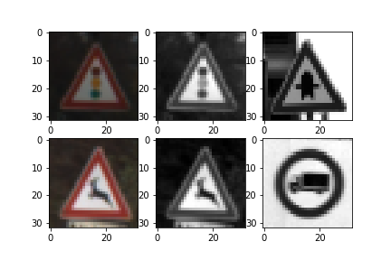

**Build a Traffic Sign Recognition Project**

The goal of this project were to develop a classifier for traffic signs using deep convolution neural nets and evaluate its performance on German Trafiic Sign dataset

####Rubric Points - I will consider the [rubric points](https://review.udacity.com/#!/rubrics/481/view) individually and describe how I addressed each point in my implementation.  

---

### Data Set Summary & Exploration

I used the pandas library to calculate summary statistics of the traffic signs data set:

* The size of training set is 34799
* The size of the validation set is 4410
* The size of test set is 12360
* The shape of a traffic sign image is 32,32,3
* The number of unique classes/labels in the data set is 43

---

### Exploratory visualization of the dataset.

Here is an exploratory visualization of the data set. It is a histogram of all class labels in the train, validation and test sets.

The histogram plots show certain classes (class ids 20-30) are underrepresented in the train and validation sets. 
Hence there might be a need to generate some synthetic data for these classes.

---

### Design and Test a Model Architecture

#### 1. Pre-processing

For pre-processing, I decided to convert the images to grayscale to eliminate effects of different lighting conditions
Here is an example of a traffic sign images from before and after grayscaling.

Another pre-processing step I tried was normalizing the data-set so all features lie in the same range but later I removed this step when I saw that normalizing the images was giving me lower accuracy than what I got with grayscale images only. I am still investigating why normalization is leading to poor results. 

I did not augment the data set for now since I could achieve the required accuracy. 

#### 2. Model architecture.

My final model consisted of the following layers:

| Layer         		|     Description	        					| 
|:---------------------:|:---------------------------------------------:| 
| Input         		| 32x32x1 Grayscale image   							| 
| Convolution 5x5     	| 1x1 stride, valid padding, outputs 28X28x6 	|
| RELU					|												|
| Max pooling	      	| 2x2 stride,  outputs 16x16x64 				|
| Convolution 5X5    | 1x1 stride, valid padding, outputs 5x5x16	|
|RELU|
|Max pooling| 2x2 stride, outputs 5x5x16
|Fully connected		| outputs 120|
|RELU|
|Fully connected		| outputs 84|
|RELU|
|Fully connected		| outputs 43|
|RELU| 
|Softmax|

#### 3. Model Training:
For model training I used the following setup and parameters:
* Meaure of error : Cross Entropy
* Optimizer type: Adam Optimizer
* Batch size : 128
* Epochs : max 200 ( the training will stop earlier if it exceeds a threshold of 93.5%)
* Learning rate: 0.001
* Dropout layer keep_probability : 0.5

#### 4. Solution Approach

In order to develop a classifier with validation accuracy over 93%, I started with a standard LeNet architecture because it has been used earlier for classification using images. 

Using LeNet architecture with the grayscaling and normalization, I observed that my training set accuracy reached ~99% but validation accuracy stayed low.

In order to improve the performance, I added regularization via dropout. I added a dropout layer after each fully connected layer with a keep_probability of 0.5. With regularization, I was able to achieve to higher validation accuracy ~90% but I noticed that it did not increase beyond that even when I tried tuning epochs and learning rate.

Based on some discusssion with fellow students, I did not normalize the data during pre-processing. Whe I train the model on grayscale images I consistently get a validation accuracy greater than 93% and a comparable test accuracy of ~92%. 

It is not clear at this point why normalization of data in this case is leading to undefitting and lower accuracies on validation set

My final model results were:
* training set accuracy of 98.8% (Cell 12 of notebook)
* validation set accuracy of 93.5% (in 30 Epochs. Cell 12 of notebook. )
* test set accuracy of 91.8% (Cell 13 of notebook)

### Test a Model on New Images

#### Here are seven (7) German traffic signs that I found on the web:

![alt text][new_image1] ![alt text][new_image2] ![alt text][new_image3] 
![alt text][new_image4] ![alt text][new_image5] ![alt text][new_image6] 
![alt text][new_image7]

* Image 1 - Road work sign is similar to few other traffic signs like right of way at next intersection  and fewer training examples. So the classifier can predict it incorect
* Image 2 - No passing sign - the image is rotated which can cause problems
* Image 3 - Pedestrian crossing sign can get confused with other similar signs
* Image 4 - Right of way at next intersection - should be easily classified. 
* Image 5 - Slippery road sign is covered with snow. Hence difficult to classify
* Image 6 - 70km/h speed limit - should be easy to classify
* Image 7 - No Entry sign should be easy to classify

#### Here are the results of the prediction:

| Image			        |     Prediction	        					| 
|:---------------------:|:---------------------------------------------:| 
| Slippery road sign      		| Right of way at next intersection 									| 
| No entry     			| Children crossing 										|
| No passing				| Road narrows on right											|
| Right of way at next intersection	      		| Right of way at next intersection		|
| Road work			| Dangerous curve to left     							|
| Speed Limit 70km/h | Speed Limit 70 km/h|
| Pedestrians | No entry|

The model was able to correctly guess **2 out of 7** traffic signs, which gives an accuracy of 28%. This is lower than the accuracy seen on test set. 

####Prediction probabilities

The code for making predictions on my final model is located in the cells 12-15 of IPython notebook

The probabilities for images are as below: 

First Image **Road Work sign - Class ID: 23**
 ![img][new_image1]

| Probability         	|     Prediction	        					| 
|:---------------------:|:---------------------------------------------:| 
| 1.0         			| 11:Right of way   									| 
| ~0.0     				| 25:Road work 										|
| ~0.0				| 0 : Speed limit 20kph											|
| ~0.0	      			| 1:Speed limit 30kph					 				|
| ~0.0				    | 2:Speed limit 40kph|

Second image : **No Passing sign - Class ID: 9**
![img][new_image2]

| Probability         	|     Prediction	        					| 
|:---------------------:|:---------------------------------------------:| 
| 1.0         			| 28:Children crossing   									| 
| ~0.0     				| 0:Speed limit 20kph 										|
| ~0.0				| 1 : Speed limit 30kph											|
| ~0.0	      			| 2:Speed limit 50kph					 				|
| ~0.0				    | 3:Speed limit 60kph|

Third image : **Pedestrians sign - Class ID: 27**
![img][new_image3]

| Probability         	|     Prediction	        					| 
|:---------------------:|:---------------------------------------------:| 
| 1.0         			| 26:Traffic Signals   									| 
| ~0.0     				| 29:Bicycles Crossing									|
| ~0.0				| 22 : Bumpy road											|
| ~0.0	      			| 39:Keep Left				 				|
| ~0.0				    | 18:General caution|

Fourth image : **Right of way at next intersection sign - Class ID: 11**
![img][new_image4]

| Probability         	|     Prediction	        					| 
|:---------------------:|:---------------------------------------------:| 
| 1.0         			| 11:Right of way   									| 
| ~0.0     				| 25:Road work 										|
| ~0.0				| 0 : Speed limit 20kph											|
| ~0.0	      			| 1:Speed limit 30kph					 				|
| ~0.0				    | 2:Speed limit 40kph|

Fifth image : **Slippery road - Class ID: 25**
![img][new_image5]

| Probability         	|     Prediction	        					| 
|:---------------------:|:---------------------------------------------:| 
| 1.0         			| 19:Dangerous curve to left  									| 
| ~0.0     				| 11:Right of way at next intersection 										|
| ~0.0				| 0 : Speed limit 20kph											|
| ~0.0	      			| 1:Speed limit 30kph					 				|
| ~0.0				    | 2:Speed limit 40kph|

Sixth image : **Speed Limit 70kph- Class ID: 4**
![img][new_image6]

| Probability         	|     Prediction	        					| 
|:---------------------:|:---------------------------------------------:| 
| 1.0         			| 4: Speed Limit70kph  									| 
| ~0.0     				| 18:General Caution									|
| ~0.0				| 0 : Speed limit 20kph											|
| ~0.0	      			| 1:Speed limit 30kph					 				|
| ~0.0				    | 2:Speed limit 50kph|

Seventh image : **No Entry sign - Class ID: 17**
![img][new_image7]

| Probability         	|     Prediction	        					| 
|:---------------------:|:---------------------------------------------:| 
| 1.0         			| 17:No Entry								| 
| ~0.0     				| 0:Speed Limit 20kph 										|
| ~0.0				| 1 : Speed limit 30kph											|
| ~0.0	      			| 2:Speed limit 50kph					 				|
| ~0.0				    | 3:Speed limit 60kph|
### (Optional) Visualizing the N eural Network (See Step 4 of the Ipython notebook for more details)
####1. Discuss the visual output of your trained network's feature maps. What characteristics did the neural network use to make classifications?

[new_image1]:../test_images/in_train_set/01.jpg
[new_image2]:../test_images/in_train_set/18.jpg
[new_image3]:../test_images/in_train_set/11.jpg
[new_image4]:../test_images/in_train_set/21.jpg
[new_image5]:../test_images/in_train_set/19.jpg
[new_image6]:../test_images/in_train_set/20.jpg
[new_image7]:../test_images/in_train_set/17.jpg
